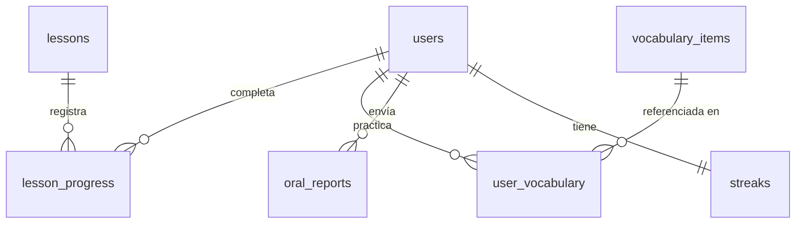
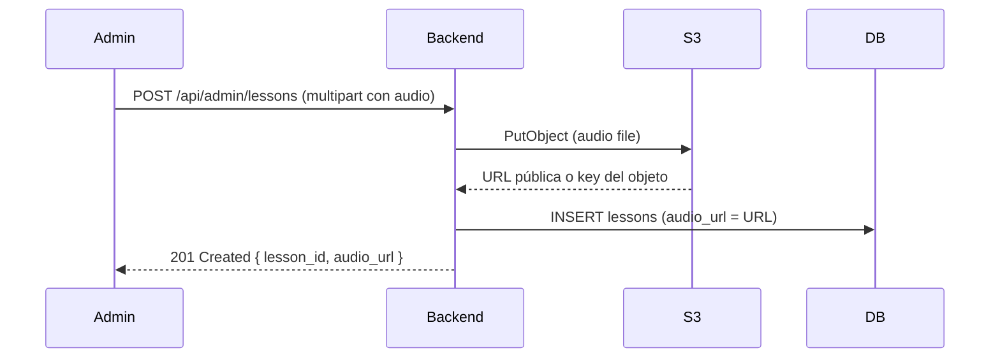
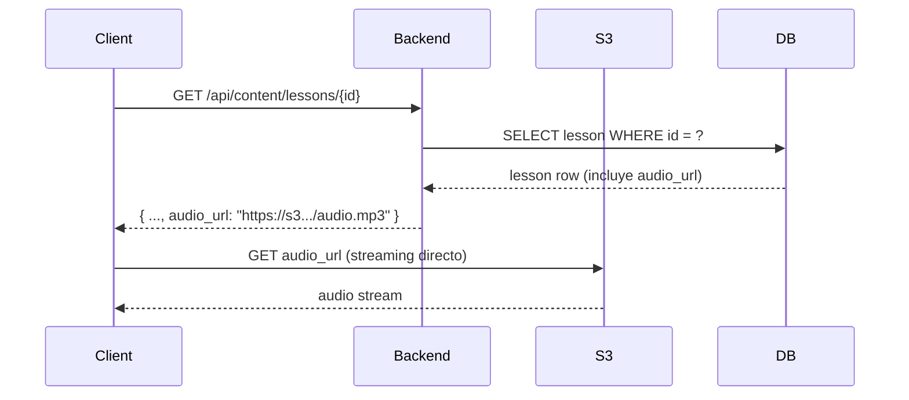

# Design Document — Drillingo

## Overview

Drillingo es una plataforma web de aprendizaje de inglés avanzado (B1–C1) centrada en el AAVE y la cultura Drill (East Coast / Midwest). La aplicación combina módulos de lectura, escucha, escritura y práctica oral con gamificación, un dashboard analítico y una estética streetwear dark-mode.

### Stack tecnológico

| Capa | Tecnología |
|---|---|
| Frontend | Next.js 14 (App Router) + Tailwind CSS |
| Backend | FastAPI (Python 3.12) |
| Base de datos | PostgreSQL 16 |
| Object Storage | AWS S3 (o Supabase Storage como alternativa) |
| Autenticación | JWT (python-jose) + bcrypt (passlib) |
| ORM | SQLAlchemy 2.x (async) + Alembic (migraciones) |
| Testing PBT | Hypothesis (Python) |
| Despliegue | Docker Compose (dev) / Railway o Render (prod) |

### Decisiones de diseño clave

- **Monolito por capas**: El backend sigue la estructura Controladores → Servicios → Repositorios. No se usa microservicios para mantener la complejidad operacional baja en la fase inicial.
- **Audio como URL, no BLOB**: Los archivos de audio se almacenan en Object Storage; la base de datos solo guarda la URL. Esto evita saturar PostgreSQL con datos binarios.
- **JSONB para oral_reports**: El campo `raw_json` usa JSONB nativo de PostgreSQL para permitir consultas directas sobre el JSON sin deserialización en la capa de aplicación.
- **Timezone del cliente para streaks**: El Streak Engine usa la timezone enviada por el cliente, no la del servidor, para calcular el límite de medianoche correcto.

---

## Architecture

### Diagrama de capas

```mermaid
graph TD
    subgraph "Frontend (Next.js)"
        A[Pages / App Router]
        B[Components]
        C[API Client (fetch)]
    end

    subgraph "Backend (FastAPI)"
        D[Routers / Controllers]
        E[Services]
        F[Repositories]
        G[Models / Schemas]
    end

    subgraph "Infraestructura"
        H[(PostgreSQL 16)]
        I[Object Storage\nAWS S3 / Supabase]
    end

    A --> B
    B --> C
    C -->|HTTP REST + JWT| D
    D --> E
    E --> F
    F --> H
    E -->|Presigned URL| I
    C -->|Audio streaming directo| I
```

### Flujo de request típico

```
Cliente (Next.js)
  → GET /api/lessons?dialect=east_coast&level=B1
  → FastAPI Router (auth middleware valida JWT)
  → ContentService.get_lessons(dialect, level)
  → LessonRepository.find_by_dialect_and_level(dialect, level)
  → PostgreSQL query
  ← Lista de lecciones con audio_url
  ← Cliente hace fetch directo a S3 para el audio
```

### Módulos del backend

| Módulo | Responsabilidad |
|---|---|
| `auth` | Registro, login, JWT |
| `content` | Lecciones, vocabulario, segmentación dialectal |
| `progress` | Registro de progreso, XP, level-up |
| `streak` | Cálculo y actualización de rachas |
| `report_parser` | Ingesta y validación de Oral Reports |
| `dashboard` | Agregación de métricas para el frontend |

---

## Components and Interfaces

### API REST — Endpoints por módulo

#### Auth (`/api/auth`)

| Método | Ruta | Descripción |
|---|---|---|
| POST | `/api/auth/register` | Registro de nuevo usuario |
| POST | `/api/auth/login` | Login, devuelve JWT |
| GET | `/api/auth/me` | Perfil del usuario autenticado |

**POST /api/auth/register — Request body:**
```json
{
  "email": "user@example.com",
  "username": "drillmaster99",
  "password": "securepass123"
}
```

**POST /api/auth/register — Response 201:**
```json
{
  "user_id": "uuid",
  "email": "user@example.com",
  "username": "drillmaster99",
  "token": "eyJhbGci..."
}
```

**Errores:**
- `409` — Email ya registrado
- `400` — Contraseña menor a 8 caracteres

---

#### Content (`/api/content`)

| Método | Ruta | Descripción |
|---|---|---|
| GET | `/api/content/lessons` | Lista lecciones (filtros: `dialect`, `level`) |
| GET | `/api/content/lessons/{lesson_id}` | Detalle de lección con módulos |
| GET | `/api/content/vocabulary` | Vocabulario (filtros: `dialect`, `level`) |
| GET | `/api/content/vocabulary/{item_id}` | Detalle de vocabulary item |

**GET /api/content/lessons — Query params:**
- `dialect`: `east_coast` | `midwest` (opcional)
- `level`: `B1` | `B2` | `C1` (opcional, default: nivel del usuario)

---

#### Progress (`/api/progress`)

| Método | Ruta | Descripción |
|---|---|---|
| POST | `/api/progress/lesson` | Registrar progreso de módulo |
| GET | `/api/progress/summary` | Resumen de progreso del usuario |
| GET | `/api/progress/vocabulary` | Vocabulario del usuario con estado mastered |
| PATCH | `/api/progress/vocabulary/{item_id}` | Actualizar interacción con vocab item |

**POST /api/progress/lesson — Request body:**
```json
{
  "lesson_id": "uuid",
  "module_type": "listening",
  "score": 85
}
```

---

#### Streak (`/api/streak`)

| Método | Ruta | Descripción |
|---|---|---|
| POST | `/api/streak/checkin` | Check-in diario (actualiza streak) |
| GET | `/api/streak` | Estado actual del streak |

**POST /api/streak/checkin — Request body:**
```json
{
  "timezone": "America/New_York"
}
```

---

#### Dashboard (`/api/dashboard`)

| Método | Ruta | Descripción |
|---|---|---|
| GET | `/api/dashboard` | Todas las métricas en una sola respuesta |

**GET /api/dashboard — Response:**
```json
{
  "level_band": "B2",
  "xp_total": 750,
  "current_streak": 7,
  "longest_streak": 14,
  "radar": {
    "reading": 72,
    "listening": 65,
    "writing": 58,
    "speaking": 80,
    "vocabulary": 70
  },
  "vocabulary_mastered_count": 42,
  "oral_history": [
    { "submitted_at": "2024-01-15T10:00:00Z", "fluency_score": 78, "pronunciation_score": 82 }
  ],
  "level_history": [
    { "date": "2024-01-01", "level_band": "B1" },
    { "date": "2024-02-10", "level_band": "B2" }
  ]
}
```

---

#### Report Parser (`/api/reports`)

| Método | Ruta | Descripción |
|---|---|---|
| POST | `/api/reports/oral` | Enviar Oral Report |
| GET | `/api/reports/oral` | Historial de reportes del usuario |

**POST /api/reports/oral — Request body:**
```json
{
  "session_duration_seconds": 1800,
  "fluency_score": 78,
  "pronunciation_score": 82,
  "notes": "Practiced Kay Flock verse"
}
```

**Errores:**
- `400` — Campo obligatorio faltante (`fluency_score` o `pronunciation_score`)
- `422` — Score fuera del rango 0–100

---

### Estructura del backend (FastAPI)

```
backend/
├── app/
│   ├── main.py                  # FastAPI app, routers
│   ├── core/
│   │   ├── config.py            # Settings (env vars)
│   │   ├── security.py          # JWT, bcrypt
│   │   └── database.py          # SQLAlchemy async engine
│   ├── models/                  # SQLAlchemy ORM models
│   │   ├── user.py
│   │   ├── lesson.py
│   │   ├── progress.py
│   │   ├── vocabulary.py
│   │   ├── oral_report.py
│   │   └── streak.py
│   ├── schemas/                 # Pydantic schemas (request/response)
│   │   ├── auth.py
│   │   ├── content.py
│   │   ├── progress.py
│   │   ├── streak.py
│   │   ├── report.py
│   │   └── dashboard.py
│   ├── routers/                 # FastAPI routers (controllers)
│   │   ├── auth.py
│   │   ├── content.py
│   │   ├── progress.py
│   │   ├── streak.py
│   │   ├── report.py
│   │   └── dashboard.py
│   ├── services/                # Business logic
│   │   ├── auth_service.py
│   │   ├── content_service.py
│   │   ├── progress_service.py
│   │   ├── streak_engine.py
│   │   ├── report_parser.py
│   │   └── dashboard_service.py
│   └── repositories/            # DB access layer
│       ├── user_repo.py
│       ├── lesson_repo.py
│       ├── progress_repo.py
│       ├── vocabulary_repo.py
│       ├── oral_report_repo.py
│       └── streak_repo.py
├── alembic/                     # Migraciones
├── tests/
│   ├── unit/
│   └── property/                # Hypothesis PBT tests
└── requirements.txt
```

### Estructura del frontend (Next.js)

```
frontend/
├── app/
│   ├── (auth)/
│   │   ├── login/page.tsx
│   │   └── register/page.tsx
│   ├── (app)/
│   │   ├── dashboard/page.tsx
│   │   ├── lessons/
│   │   │   ├── page.tsx          # Lista de lecciones
│   │   │   └── [id]/page.tsx     # Lección individual
│   │   ├── modules/
│   │   │   ├── reading/[id]/page.tsx
│   │   │   ├── listening/[id]/page.tsx
│   │   │   ├── writing/[id]/page.tsx
│   │   │   └── speaking/page.tsx
│   │   ├── vocabulary/page.tsx
│   │   └── reports/page.tsx
│   └── layout.tsx
├── components/
│   ├── ui/                       # Primitivos (Button, Card, Badge)
│   ├── dashboard/
│   │   ├── RadarChart.tsx
│   │   ├── LevelProgressBar.tsx
│   │   ├── OralHistoryChart.tsx
│   │   └── StreakDisplay.tsx
│   ├── modules/
│   │   ├── ChatBubble.tsx        # Reading module
│   │   ├── AudioPlayer.tsx       # Listening module
│   │   ├── FillInBlank.tsx       # Listening module
│   │   ├── TranslationInput.tsx  # Writing module
│   │   └── OralReportForm.tsx    # Speaking module
│   └── layout/
│       ├── Navbar.tsx
│       └── StreakBadge.tsx
├── lib/
│   ├── api.ts                    # API client (fetch wrapper)
│   └── auth.ts                   # Auth helpers
└── tailwind.config.ts
```

---

## Data Models

### Enums PostgreSQL

```sql
CREATE TYPE level_band_enum AS ENUM ('B1', 'B2', 'C1');
CREATE TYPE dialect_segment_enum AS ENUM ('east_coast', 'midwest');
CREATE TYPE module_type_enum AS ENUM ('reading', 'listening', 'writing', 'speaking');
```

### DDL completo

```sql
-- Extensión para UUIDs
CREATE EXTENSION IF NOT EXISTS "pgcrypto";

-- ============================================================
-- TABLA: users
-- ============================================================
CREATE TABLE users (
    id              UUID PRIMARY KEY DEFAULT gen_random_uuid(),
    email           VARCHAR(255) NOT NULL UNIQUE,
    username        VARCHAR(100) NOT NULL UNIQUE,
    password_hash   VARCHAR(255) NOT NULL,
    level_band      level_band_enum NOT NULL DEFAULT 'B1',
    xp_total        INTEGER NOT NULL DEFAULT 0,
    created_at      TIMESTAMPTZ NOT NULL DEFAULT NOW(),
    updated_at      TIMESTAMPTZ NOT NULL DEFAULT NOW()
);

CREATE INDEX idx_users_email ON users(email);

-- ============================================================
-- TABLA: lessons
-- ============================================================
CREATE TABLE lessons (
    id               UUID PRIMARY KEY DEFAULT gen_random_uuid(),
    title            VARCHAR(255) NOT NULL,
    dialect_segment  dialect_segment_enum NOT NULL,
    level_band       level_band_enum NOT NULL,
    day_order        INTEGER NOT NULL,
    audio_url        VARCHAR(2048) NOT NULL,
    created_at       TIMESTAMPTZ NOT NULL DEFAULT NOW()
);

CREATE INDEX idx_lessons_dialect_level ON lessons(dialect_segment, level_band);
CREATE INDEX idx_lessons_day_order ON lessons(day_order);

-- ============================================================
-- TABLA: lesson_progress
-- ============================================================
CREATE TABLE lesson_progress (
    id           UUID PRIMARY KEY DEFAULT gen_random_uuid(),
    user_id      UUID NOT NULL REFERENCES users(id) ON DELETE CASCADE,
    lesson_id    UUID NOT NULL REFERENCES lessons(id) ON DELETE CASCADE,
    module_type  module_type_enum NOT NULL,
    score        INTEGER NOT NULL CHECK (score >= 0 AND score <= 100),
    completed_at TIMESTAMPTZ NOT NULL DEFAULT NOW()
);

CREATE INDEX idx_lesson_progress_user ON lesson_progress(user_id);
CREATE INDEX idx_lesson_progress_lesson ON lesson_progress(lesson_id);
CREATE INDEX idx_lesson_progress_user_module ON lesson_progress(user_id, module_type);

-- ============================================================
-- TABLA: vocabulary_items
-- ============================================================
CREATE TABLE vocabulary_items (
    id               UUID PRIMARY KEY DEFAULT gen_random_uuid(),
    term             VARCHAR(255) NOT NULL,
    definition       TEXT NOT NULL,
    example_sentence TEXT,
    dialect_segment  dialect_segment_enum,
    level_band       level_band_enum,
    created_at       TIMESTAMPTZ NOT NULL DEFAULT NOW()
);

CREATE INDEX idx_vocab_dialect ON vocabulary_items(dialect_segment);
CREATE INDEX idx_vocab_level ON vocabulary_items(level_band);

-- ============================================================
-- TABLA: user_vocabulary
-- ============================================================
CREATE TABLE user_vocabulary (
    user_id             UUID NOT NULL REFERENCES users(id) ON DELETE CASCADE,
    vocabulary_item_id  UUID NOT NULL REFERENCES vocabulary_items(id) ON DELETE CASCADE,
    mastered            BOOLEAN NOT NULL DEFAULT FALSE,
    correct_count       INTEGER NOT NULL DEFAULT 0,
    last_reviewed_at    TIMESTAMPTZ,
    PRIMARY KEY (user_id, vocabulary_item_id)
);

CREATE INDEX idx_user_vocab_mastered ON user_vocabulary(user_id, mastered);

-- ============================================================
-- TABLA: oral_reports
-- ============================================================
CREATE TABLE oral_reports (
    id                       UUID PRIMARY KEY DEFAULT gen_random_uuid(),
    user_id                  UUID NOT NULL REFERENCES users(id) ON DELETE CASCADE,
    raw_json                 JSONB NOT NULL,
    fluency_score            INTEGER NOT NULL CHECK (fluency_score >= 0 AND fluency_score <= 100),
    pronunciation_score      INTEGER NOT NULL CHECK (pronunciation_score >= 0 AND pronunciation_score <= 100),
    session_duration_seconds INTEGER,
    submitted_at             TIMESTAMPTZ NOT NULL DEFAULT NOW()
);

CREATE INDEX idx_oral_reports_user ON oral_reports(user_id);
CREATE INDEX idx_oral_reports_submitted ON oral_reports(user_id, submitted_at DESC);
-- Índice GIN para consultas JSONB
CREATE INDEX idx_oral_reports_raw_json ON oral_reports USING GIN (raw_json);

-- ============================================================
-- TABLA: streaks
-- ============================================================
CREATE TABLE streaks (
    user_id            UUID PRIMARY KEY REFERENCES users(id) ON DELETE CASCADE,
    current_streak     INTEGER NOT NULL DEFAULT 0,
    longest_streak     INTEGER NOT NULL DEFAULT 0,
    last_activity_date DATE
);
```

### Relaciones entre tablas



---

## Object Storage Architecture

### Flujo de subida de audio (admin/content creator)



### Flujo de reproducción de audio (usuario)



**Decisión de diseño**: Se usan URLs públicas con CORS configurado en el bucket S3, no presigned URLs, para simplificar el flujo. Si el contenido requiere protección, se puede migrar a presigned URLs con TTL de 1 hora sin cambiar el esquema de base de datos.

### Configuración S3

```
Bucket: drillingo-audio-{env}
Región: us-east-1
CORS: Allow GET desde el dominio de la app
Estructura de keys: audio/{dialect}/{level}/{lesson_id}.mp3
```

---

## Streak Engine

### Lógica de cálculo

El Streak Engine opera sobre la tabla `streaks` y recibe la timezone del cliente en cada check-in.

```python
# streak_engine.py (pseudocódigo)

from datetime import datetime, date
import pytz

def process_checkin(user_id: str, client_timezone: str, db: Session) -> StreakResult:
    tz = pytz.timezone(client_timezone)
    today_client = datetime.now(tz).date()  # Fecha en la TZ del cliente

    streak = db.get_streak(user_id)

    if streak.last_activity_date is None:
        # Primera actividad
        streak.current_streak = 1
        streak.last_activity_date = today_client

    elif streak.last_activity_date == today_client:
        # Ya hizo check-in hoy, no cambiar
        pass

    elif streak.last_activity_date == today_client - timedelta(days=1):
        # Día consecutivo
        streak.current_streak += 1

    else:
        # Rompió la racha
        streak.current_streak = 1

    # Actualizar longest_streak si corresponde
    if streak.current_streak > streak.longest_streak:
        streak.longest_streak = streak.current_streak

    streak.last_activity_date = today_client
    db.save(streak)
    return streak
```

### Invariante del streak

El `current_streak` en el día N es igual al número de días consecutivos con actividad terminando en el día N. Esta propiedad se verifica formalmente en la sección de Correctness Properties.

### Manejo de timezone

- El cliente envía `timezone` como string IANA (ej: `"America/Chicago"`) en el body del POST `/api/streak/checkin`.
- El backend valida que sea una timezone IANA válida usando `pytz.timezone()`.
- Si la timezone es inválida, devuelve HTTP 400.
- `last_activity_date` se almacena como `DATE` (sin hora) en la timezone del cliente.

---

## Correctness Properties

*A property is a characteristic or behavior that should hold true across all valid executions of a system — essentially, a formal statement about what the system should do. Properties serve as the bridge between human-readable specifications and machine-verifiable correctness guarantees.*

### Property 1: Round-trip de Oral Report

*For any* objeto JSON válido que contenga `fluency_score` (0–100), `pronunciation_score` (0–100) y `session_duration_seconds` (entero positivo), parsear el JSON y luego serializarlo de vuelta SHALL producir un objeto semánticamente equivalente al original.

**Validates: Requirements 7.7**

---

### Property 2: Invariante del Streak

*For any* secuencia de fechas de actividad diaria (lista de fechas en orden cronológico), el `current_streak` calculado por el Streak Engine en el último día de la secuencia SHALL ser igual al número de días consecutivos con actividad terminando en ese día.

**Validates: Requirements 8.7**

---

### Property 3: Validación de scores fuera de rango

*For any* valor entero fuera del rango [0, 100] enviado como `fluency_score` o `pronunciation_score` en un Oral Report, el Report Parser SHALL rechazar el request con HTTP 422.

**Validates: Requirements 7.4**

---

### Property 4: Filtrado de lecciones por dialecto

*For any* consulta al Content Service con un `dialect_segment` específico (`east_coast` o `midwest`), todos los elementos de la lista de lecciones devuelta SHALL tener el mismo `dialect_segment` que el solicitado.

**Validates: Requirements 3.1**

---

### Property 5: Consistencia longest_streak

*For any* secuencia de check-ins procesados por el Streak Engine, el `longest_streak` SHALL ser siempre mayor o igual al `current_streak`.

**Validates: Requirements 8.2**

---

## Error Handling

### Estrategia global

FastAPI usa exception handlers globales para convertir excepciones de dominio en respuestas HTTP consistentes.

```python
# Formato de error estándar
{
  "error": "EMAIL_ALREADY_REGISTERED",
  "message": "Email already registered",
  "status_code": 409
}
```

### Tabla de errores por módulo

| Módulo | Condición | HTTP | Mensaje |
|---|---|---|---|
| Auth | Email duplicado | 409 | "Email already registered" |
| Auth | Contraseña < 8 chars | 400 | "Password must be at least 8 characters" |
| Auth | Credenciales inválidas | 401 | "Invalid credentials" |
| Auth | Token expirado/inválido | 401 | "Token expired or invalid" |
| Report Parser | Campo obligatorio faltante | 400 | "Missing required field: {field_name}" |
| Report Parser | Score fuera de rango | 422 | "Score must be between 0 and 100" |
| Streak | Timezone inválida | 400 | "Invalid timezone: {tz}" |
| Content | Lección no encontrada | 404 | "Lesson not found" |
| General | Error interno | 500 | "Internal server error" |

### Validación de entrada

- Todos los schemas de request usan Pydantic v2 con validadores estrictos.
- Los UUIDs se validan automáticamente por Pydantic.
- Los enums se validan contra los valores definidos en PostgreSQL.

---

## Testing Strategy

### Enfoque dual: Unit tests + Property-Based Tests

#### Unit tests (pytest)

Se usan para verificar comportamientos específicos y casos de borde:

- Registro con email duplicado devuelve 409
- Login con contraseña incorrecta devuelve 401
- Progreso de lección actualiza XP correctamente
- Level-up se dispara al cruzar el umbral de XP
- Dashboard devuelve respuesta en < 500ms (test de integración)

#### Property-Based Tests (Hypothesis)

Se usa [Hypothesis](https://hypothesis.readthedocs.io/) para verificar las propiedades universales definidas en la sección anterior.

**Configuración mínima**: 100 iteraciones por propiedad (`settings(max_examples=100)`).

**Tag format**: Cada test incluye un comentario con el formato:
`# Feature: drillingo, Property {N}: {property_text}`

##### Implementación de propiedades

**Property 1 — Round-trip de Oral Report:**
```python
# Feature: drillingo, Property 1: oral report JSON round-trip
@given(
    fluency_score=st.integers(min_value=0, max_value=100),
    pronunciation_score=st.integers(min_value=0, max_value=100),
    session_duration_seconds=st.integers(min_value=1, max_value=86400),
    notes=st.one_of(st.none(), st.text(max_size=500))
)
@settings(max_examples=100)
def test_oral_report_round_trip(fluency_score, pronunciation_score,
                                 session_duration_seconds, notes):
    payload = {
        "fluency_score": fluency_score,
        "pronunciation_score": pronunciation_score,
        "session_duration_seconds": session_duration_seconds,
    }
    if notes is not None:
        payload["notes"] = notes

    parsed = OralReportSchema(**payload)
    serialized = parsed.model_dump(exclude_none=True)
    re_parsed = OralReportSchema(**serialized)

    assert re_parsed.fluency_score == parsed.fluency_score
    assert re_parsed.pronunciation_score == parsed.pronunciation_score
    assert re_parsed.session_duration_seconds == parsed.session_duration_seconds
```

**Property 2 — Invariante del Streak:**
```python
# Feature: drillingo, Property 2: streak invariant
@given(
    activity_dates=st.lists(
        st.dates(min_value=date(2024, 1, 1), max_value=date(2025, 12, 31)),
        min_size=1, max_size=365
    ).map(sorted).map(list)
)
@settings(max_examples=100)
def test_streak_invariant(activity_dates):
    streak = compute_streak_from_dates(activity_dates)
    # El current_streak debe ser igual al número de días consecutivos
    # terminando en el último día de la secuencia
    expected = count_consecutive_days_ending_at(activity_dates, activity_dates[-1])
    assert streak.current_streak == expected
```

**Property 3 — Scores fuera de rango rechazados:**
```python
# Feature: drillingo, Property 3: out-of-range scores rejected
@given(
    score=st.one_of(
        st.integers(max_value=-1),
        st.integers(min_value=101)
    )
)
@settings(max_examples=100)
def test_invalid_score_rejected(score):
    with pytest.raises(ValidationError):
        OralReportSchema(
            fluency_score=score,
            pronunciation_score=50,
            session_duration_seconds=600
        )
```

**Property 4 — Filtrado de lecciones por dialecto:**
```python
# Feature: drillingo, Property 4: dialect filter consistency
@given(
    dialect=st.sampled_from(["east_coast", "midwest"]),
    lessons=st.lists(lesson_strategy(), min_size=0, max_size=50)
)
@settings(max_examples=100)
def test_dialect_filter_returns_only_matching(dialect, lessons):
    filtered = filter_lessons_by_dialect(lessons, dialect)
    assert all(lesson.dialect_segment == dialect for lesson in filtered)
```

**Property 5 — Consistencia longest_streak:**
```python
# Feature: drillingo, Property 5: longest_streak >= current_streak
@given(
    activity_dates=st.lists(
        st.dates(min_value=date(2024, 1, 1), max_value=date(2025, 12, 31)),
        min_size=1, max_size=365
    ).map(sorted).map(list)
)
@settings(max_examples=100)
def test_longest_streak_invariant(activity_dates):
    streak = compute_streak_from_dates(activity_dates)
    assert streak.longest_streak >= streak.current_streak
```

### Cobertura objetivo

| Capa | Herramienta | Objetivo |
|---|---|---|
| Servicios (lógica pura) | pytest + Hypothesis | 90% |
| Routers (HTTP) | pytest + TestClient | 80% |
| Repositorios | pytest + DB en memoria (SQLite) | 70% |
| Frontend | Vitest + Testing Library | 70% |
| E2E | Playwright | Flujos críticos |
