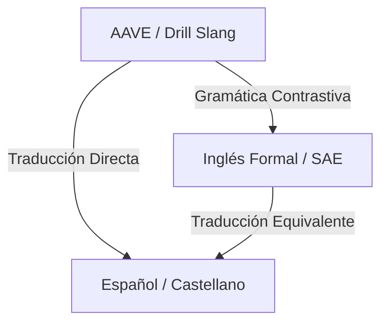

# 🎤 Drillingo: Plataforma de Aprendizaje AAVE & Drill (Manual Completo)

Bienvenido al manual oficial de **Drillingo**, la plataforma interactiva y bilingüe de aprendizaje de idiomas diseñada para enseñar **AAVE (African American Vernacular English)** y la jerga de la cultura **Drill** mediante un innovador método de contraste gramatical de tres capas: jerga original, inglés estándar (SAE) y traducción al español.

---

## 📖 1. Visión General del Producto

Drillingo no es una aplicación de idiomas común. Está diseñada para cerrar la brecha cultural y lingüística de la música urbana, el rap y la vida urbana norteamericana para hispanohablantes. 

A través de un enfoque pedagógico riguroso basado en el **Marco Común Europeo de Referencia (MCER)**, los usuarios avanzan desde el nivel **B1** hasta el **C1**, aprendiendo cómo se estructuran las frases callejeras, su equivalente en inglés formal y su significado exacto en español.



---

## 🛠️ 2. Módulos Interactivos de Aprendizaje

Cada lección del mapa de ruta de Drillingo está compuesta por **cuatro módulos prácticos** que abarcan todas las habilidades lingüísticas primordiales:

### 📖 Módulo 1: Reading (Comprensión Lectora)
*   **Presentación Tri-capa:** El usuario lee un texto original en AAVE. Al hacer clic o pasar el mouse sobre la tarjeta, se despliega una comparativa visual:
    1.  **AAVE/Drill Slang:** Texto original con palabras resaltadas.
    2.  **SAE (Standard American English):** Transposición gramatical formal.
    3.  **Español:** Traducción adaptada al contexto latinoamericano.
*   **Desglose Dinámico:** Listado automático de términos complejos explicados de forma interactiva.

### 🎧 Módulo 2: Listening (Comprensión Auditiva)
*   **Integración Multimedia:** Reproductor de música (con soporte para videos reales de YouTube y fragmentos musicales de artistas como *Kay Flock*, *Chief Keef*, etc.).
*   **Fill in the Blanks (Completar Espacios):** El usuario escucha la barra/lírica de la canción y completa las palabras faltantes arrastrando y soltando términos del dialecto estudiado.

### ✍️ Módulo 3: Writing (Expresión Escrita)
*   **Traducción Inversa:** Se presenta al usuario una oración formal en español o inglés estándar, y este debe escribir la traducción correspondiente en AAVE/Drill.
*   **Evaluación Inteligente:** Lógica local de comparación de variantes aceptadas con un backend preparado para expandirse con análisis semántico.

### 🎤 Módulo 4: Speaking (Expresión Oral)
*   **Grabadora de Voz Inmersiva:** El usuario graba su voz pronunciando barras y frases icónicas en AAVE.
*   **Soporte Fonético:** Consejos y tips específicos de entonación y acentuación nativa (ej. la pronunciación suave de la "d" en lugar de "th").

---

## 🗃️ 3. Módulo de Vocabulario y Flashcards

El diccionario integrado de Drillingo sirve como herramienta de consulta rápida y memorización:

*   **Tarjetas con Vista de 3 Capas:** Cada término detalla su dialecto de origen (ej. *NYC* para East Coast o *CHI* para Midwest), su nivel MCER (B1-C1), su definición en inglés formal y su traducción exacta en español.
*   **Ejemplos de Contexto Bilingües:** Al presionar **"Ver ejemplo"**, se despliega una oración real de uso en AAVE junto a su traducción en español.
*   **Flashcards Inteligentes:** Sistema interactivo de memorización donde la tarjeta gira al hacer clic, permitiendo al usuario evaluar si conoce la definición y el equivalente en español de forma activa.
*   **Algoritmo de Dominio:** Las respuestas correctas acumulan progreso. Al acertar un término **3 veces**, se marca automáticamente como **Dominado (Mastered)**, otorgando un bono de experiencia.

---

## 📈 4. Gamificación y Economía de Experiencia (XP)

El sistema de progresión recompensa el esfuerzo real y el rendimiento de forma equitativa:

### Rango de XP por Módulo
| Módulo | Dificultad | XP Máxima (100% Score) | Enfoque Pedagógico |
| :--- | :--- | :--- | :--- |
| **Reading** | Baja | **5 XP** | Lectura pasiva y asimilación conceptual. |
| **Speaking** | Media | **8 XP** | Práctica oral y fluidez de pronunciación. |
| **Listening** | Media-Alta | **10 XP** | Reconocimiento auditivo de líricas rápidas. |
| **Writing** | Alta | **20 XP** | Producción escrita activa desde cero. |

### Descuento por Desempeño
La experiencia se calcula multiplicando el XP base por el rendimiento obtenido en la lección:
*   **90% - 100% de aciertos:** **100%** del XP Base (¡Perfecto!).
*   **70% - 89% de aciertos:** **70%** del XP Base (¡Bien hecho!).
*   **50% - 69% de aciertos:** **50%** del XP Base (Aprobado).
*   **Menos del 50%:** **20%** del XP Base (Recompensa mínima por el intento).

### Umbrales de Nivel (Level-Up)
El rango del usuario (`level_band`) se actualiza automáticamente al acumular XP total en su perfil:
*   🟢 **B1 (Principiante - Por defecto):** Nivel base de ingreso.
*   🔵 **B2 (Intermedio):** Requiere **300 XP** acumulados.
*   🟣 **C1 (Avanzado / Nativo):** Requiere **1200 XP** acumulados.

---

## 💻 5. Arquitectura y Stack Tecnológico

Drillingo cuenta con un diseño de software moderno, desacoplado y de alta eficiencia:

### Frontend
*   **Framework:** Next.js 14 (App Router) con TypeScript.
*   **Estilos:** Vanilla CSS moderno con variables HSL personalizadas, efectos de desenfoque de fondo (*glassmorphism*), animaciones de transición fluidas y soporte completo para modo oscuro (diseño nocturno urbano).
*   **Componentes Clave:**
    *   `SpeakingRecorder`: Manejo nativo de APIs de audio del navegador para grabación de voz.
    *   `VocabularyMatch`: Mecánica interactiva de asociación drag-and-drop de significados.
    *   `CelebrationOverlay`: Animación premium y barra de experiencia dinámica al finalizar un módulo.

### Backend
*   **Framework:** FastAPI (Python 3.12).
*   **Base de Datos:** PostgreSQL administrado, con soporte para consultas asíncronas vía **SQLAlchemy 2.0** y migraciones automáticas con **Aembic**.
*   **Servicios de IA:** Integración directa con **Google Gemini Pro** para la evaluación semántica contextual de módulos de escritura y la calificación de audio de voz.

---

## 🗄️ 6. Esquema de Datos y Sistema del Seed

Para evitar migraciones complejas de base de datos al añadir español, Drillingo almacena la información localizada de forma inteligente utilizando delimitadores de tubería (`|`):

### Patrón de Localización en Base de Datos
*   **Definición de Vocabulario:** `Inglés Formal | Traducción al Español`
    *   *Ejemplo:* `To lose control and act recklessly. | Perder el control y actuar de forma imprudente.`
*   **Oraciones de Ejemplo:** `Ejemplo en AAVE | Traducción del Ejemplo`
    *   *Ejemplo:* `He crashed out on them boys. | Él perdió el control con esos muchachos.`

El frontend realiza un procesamiento `.split("|")` en tiempo de ejecución para estructurar y presentar visualmente los bloques en tarjetas estilizadas de forma independiente.

---

## 🚀 7. Flujo de Trabajo para Despliegues y Mantenimiento

Para actualizar el contenido educativo en producción de forma rápida y segura sin afectar el servicio activo:

1.  **Modificar el Seed Local:** Actualizar los diccionarios en `backend/seed.py` respetando el formato delimitado `|`.
2.  **Sincronizar Producción:** Ejecutar el actualizador directo desde la terminal del backend:
    ```bash
    set PYTHONIOENCODING=utf-8 && python seed_railway.py
    ```
    *(Este comando limpia las tablas previas e inyecta las lecciones, oraciones y vocabularios optimizados directamente en la base de datos de Railway en tiempo récord).*

---

*Manual de producto Drillingo - 2026. Diseñado para dominar la calle, barra por barra.*
